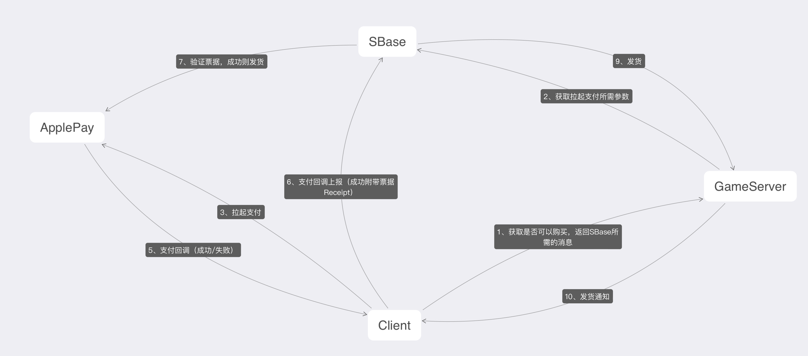

# sbasedoc

## 接口文档

接口文档中的地址统一通过Tag配置来获取

## 登录
所有登录回复结构通用

[EM登录](#EM)

[微信登录](#wechat)

[TapTap登录](#TapTap)

[QQ登录](#qq)

[英雄登录](#hero)

[第三方登录](#third)

[APPLE登录](#apple)

登录通用回复 [LoginResult](#LoginResult)

[实名认证](#realcheck)

## 支付

[微信支付](#wechatpay)

#### <a id="EM">EM登录</a>

路径：/EMLogin
```
Method: POST
ContentType: application/json
```

###### 参数
```go
type EmLoginRequest struct {
	// em参数
	E string `json:"e"`
	M string `json:"m"`
}
```

#### <a id="wechat">微信登录</a> 
路径：/WechatLogin

[微信官方接入文档](https://developers.weixin.qq.com/doc/oplatform/Mobile_App/WeChat_Login/Development_Guide.html)

```
Method: POST
ContentType: application/json
```

###### 参数
```go
type WechatLoginRequest struct {
	Namespace int `json:"namespace"` //预留，可不填
	Code string `json:"code"` //授权临时票据（code）
}
```

#### <a id="TapTap">TapTap登录</a> 
路径：/TapTapLogin 

[TapTap官方接入文档](https://developer.taptap.cn/docs/sdk/taptap-login/guide/start/)

```
Method: POST
ContentType: application/json
```

###### 参数
```go
type TTLoginRequest struct {
    Namespace int `json:"namespace"` //预留，可不填

    AccessToken string `json:"accessToken"` //登录成功后 TapSDK 返回的 access_token
    MacKey      string `json:"macKey"` //登录成功后 TapSDK 返回的 mac_key
}
```
#### <a id="qq">QQ登录</a>
路径: /QQLogin

[QQ官方接入文档](https://wiki.connect.qq.com/qq%e7%99%bb%e5%bd%95)
```
Method: POST
ContentType: application/json
```

###### 参数
```go
type QQLoginRequest struct {
    Namespace int `json:"namespace"` //预留，可不填

    AccessToken string `json:"access_token"` 
}
```

#### <a id="hero">英雄登录 </a>
路径：/YXLogin

直接验证账号密码
```
Method: POST
ContentType: application/json
```

##### 参数
```go
type YXLoginRequest struct {
    Namespace int `json:"namespace"` //预留，可不填

    Account string `json:"account"` 
    Passwd  string `json:"passwd"`
}
```

#### <a id="third">第三方登录</a>
对应之前的渠道登录

路径：/ThirdLogin

```
Method: POST
ContentType: application/json
```

###### 参数
```go
type ThirdLoginRequest struct {
    Namespace int `json:"namespace"` //预留，可不填

    Cuid string `json:"cuid"`
}
```

#### <a id="apple">APPLE登录</a> 
路径：/AppleLogin

[Apple 接入文档](https://blog.unity.com/technology/support-for-apple-sign-in)
```
Method: POST
ContentType: application/json
```

###### 参数
```go
type AppleLoginRequest struct {
    Namespace int `json:"namespace"` //预留，可不填 

    Code string `json:"code"`
}
```


### <a id="LoginResult">通用登录回复</a> 

```go
type LoginResult struct {
Code int `json:"code"`

    E string `json:"e"`
    M string `json:"m"`

    Uid         int64  `json:"uid"` //S-gameId
    DisplayName string `json:"display_name"` // YX Third 没有返回（待定）

    PFType string `json:"pf_type"`
    PFID   string `json:"pf_id"`

    Token string `json:"token"`
    Key   string `json:"key"`

    IsWlc bool `json:"is_wlc"` //是否实名认证 如果没有实名认证 需要跳转到实名认证页面
}
```

#### <a id="code">code中台常量定义</a> 
```go
const (
    CODE_SUCCESS           = 200 //成功
    CODE_PARAM_MISS        = 116 //参数缺失
    CODE_SERVICE_BUSY      = 126 //服务器繁忙（内部逻辑错误）
    CODE_TOKEN_EXPIRED     = 128 //令牌已过期
    CODE_INVALID_NAMESPACE = 157 //无效的Namespace
    CODE_PASSWORD_ERROR    = 158 //密码错误
    CODE_ACCOUNT_NOT_EXIST = 159 //账号不存在
    CODE_SEND_SMS_TOO_FAST = 160 //发送短信过快
    CODE_VALIDATE_CODE_ERR = 161 //验证码错误
    CODE_PAYCALLBACK_ERROR = 162 //支付回调错误
    CODE_MOBILE_EXIST      = 163 //手机账号已存在
    BAN_SANDBOX            = 164 //禁止沙盒测试
    WLC_ACCOUNT_NOT_EXIST  = 165 //账号不存在
    WLC_TRACE_ERROR        = 166 //wlc上报失败
    WLC_CHECH_ERROR        = 166 //wlc校验失败
    WLC_QUERY_ERROR        = 167 //wlc查询失败
    CODE_NOT_FOUND         = 404 //APPLE资源不存在
    CODE_SERVER_ERROR      = 500 //APPLE服务器错误
)
```

#### <a id="realcheck">实名认证</a>   
路径：/WlcCheck

```
Method: POST
ContentType: application/json
```

###### 参数
```go
// CheckParam 实名认证请求参数
type CheckParam struct {
    // em参数
    E string `json:"e"`
    M string `json:"m"`
	
    Name  string `json:"name"`  // 用户姓名
    IdNum string `json:"idNum"` // 用户身份证号码
}

type CheckResult struct {
    Code int `json:"code"` //返回值参照code中台常量定义,位置位于登录模块最后
}
```
[code中台常量定义](#code)

## 支付

apple支付需要特殊处理

[apple支付接入文档](https://developer.apple.com/documentation/passkit/apple_pay/offering_apple_pay_in_your_app)



#### 苹果支付回调 /AppleVerifyIdTokenV1 (前端)
```go
// 苹果支付回调
type ApplePayVerifyIdTokenV1 struct {
    GameId  string `json:"game_id"`
    SgameId string `json:"sgame_id"`
    Receipt string `json:"receipt"`
}
```