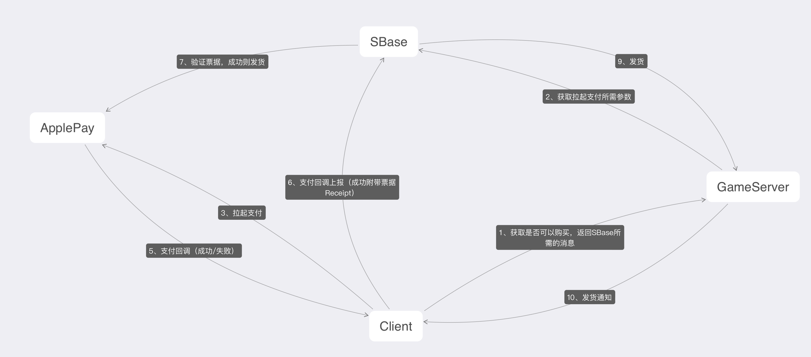

# sbasedoc 中台接入文档--后端版本

## 接口文档

### 登录
[用户登录](#login)

[用户行为上传](#usertrace)
### 支付
[支付下单](#transaction)

[支付发货](#sendgoods)

---
### <a id="login">用户登录</a>
EMLogin 为公司快捷登录 PFLogin 为平台登录，例如：微信，QQ.....


暂时直接明文传送 LoginToken => SGameId，后续会改为加密传送
### <a id="usertrace">用户行为上传</a> 
路径：/WlcLoginTrace

```
Method: POST
ContentType: application/json
```

```go
// 请求参数 LoginTraceParam 用户行为数据上报请求参数
type WLcLoginTraceReq struct {
    Collections []*WlcLoginTrace `json:"collections"`
}

type WlcLoginTrace struct {
    SGameId   string     `json:"s_game_Id"`  // 游戏用户标识
    LoginTime string     `json:"login_time"` // 游戏用户登录时间
    BT        int        `json:"bt"`         // 游戏用户行为类型 0：下线 1：上线
    PI        string     `json:"pi"`         // 已通过实名认证用户的唯一标识 (服务器)
}

//响应参数
type WlcResp struct {
    Code int `json:"code"` //参考 code 中台常量定义
}
```
[code中台常量定义](#code)

## 支付
PF常用支付流程图


<a id="transaction">支付下单</a>

```
Method: POST
ContentType: application/json
```

```go

//支付类型
const (
    TA_WECHAT TypeTransaction = "WX" // 微信
    TA_ALI    TypeTransaction = "AL" // 支付宝
    TA_APPLE  TypeTransaction = "AP" // 苹果
)

type TypeTransaction string

//货币信息
type Amount struct {
    Total    float64 `json:"total"`   // 总金额
    Currency string  `json:"currency"`  // 货币类型 可不填，不填情况下默认为 CNY：人民币
}

//下单请求
type TransactionRequest struct {
    GameOrderId   string          `json:"game_order_id"`    // 游戏订单号，可不填
    Desc          string          `json:"description"`    // 商品描述
    Amount        Amount          `json:"amount"`      // 金额
    GameNotifyUrl string          `json:"game_notify_url"`  // 游戏回调地址
    Attach        string          `json:"attach"`     // 服务器透传参数,回调时原样返回
    SGameId       string          `json:"s_game_id"`    // 游戏用户标识
    Type          TypeTransaction `json:"type"`       // 支付类型
    GameId        string          `json:"game_id"`   // 游戏ID 由平台分配 预留字段可不填
    IsSandbox     bool            `json:"is_sandbox"`   // 是否沙盒测试 仅苹果支付有效 默认false 
}

//下单响应
type TransactionResponse struct {
    Code  int              `json:"code"`
    Type  TypeTransaction  `json:"type"`
    Param TransactionParam `json:"param"`
}

//掉起支付参数
type TransactionParam struct {
    WeChatAppPayParam        *wechat.AppPayParams `json:"wechat_app_pay_param"`
    AliOrderInfo             string               `json:"ali_order_info"`
    AppleApplicationUsername string               `json:"apple_application_username"`
}

//wechat.AppPayParams
type AppPayParams struct {
    Appid     string `json:"appid"`  
    Partnerid string `json:"partnerid"`
    Prepayid  string `json:"prepayid"`
    Package   string `json:"package"`
    Noncestr  string `json:"noncestr"`
    Timestamp string `json:"timestamp"`
    Sign      string `json:"sign"`
}
```

<a id="sendgoods">发货</a>

服务器实现回调

```go
//通知参数
type SendGoodsReq struct {
	OrderId string `json:"order_id"`
	Attach  string `json:"attach"`
	Token   string `json:"token"`
}

//响应参数
SendGoodsResp struct {
	Code int `json:"code"`
}
```

### <a id="code">code中台常量定义</a>
```go
const (
    CODE_SUCCESS           = 200 //成功
    CODE_PARAM_MISS        = 116 //参数缺失
    CODE_SERVICE_BUSY      = 126 //服务器繁忙（内部逻辑错误）
    CODE_TOKEN_EXPIRED     = 128 //令牌已过期
    CODE_INVALID_NAMESPACE = 157 //无效的Namespace
    CODE_PASSWORD_ERROR    = 158 //密码错误
    CODE_ACCOUNT_NOT_EXIST = 159 //账号不存在
    CODE_SEND_SMS_TOO_FAST = 160 //发送短信过快
    CODE_VALIDATE_CODE_ERR = 161 //验证码错误
    CODE_PAYCALLBACK_ERROR = 162 //支付回调错误
    CODE_MOBILE_EXIST      = 163 //手机账号已存在
    BAN_SANDBOX            = 164 //禁止沙盒测试
    WLC_ACCOUNT_NOT_EXIST  = 165 //账号不存在
    WLC_TRACE_ERROR        = 166 //wlc上报失败
    WLC_CHECH_ERROR        = 166 //wlc校验失败
    WLC_QUERY_ERROR        = 167 //wlc查询失败
    CODE_NOT_FOUND         = 404 //APPLE资源不存在
    CODE_SERVER_ERROR      = 500 //APPLE服务器错误
)
```