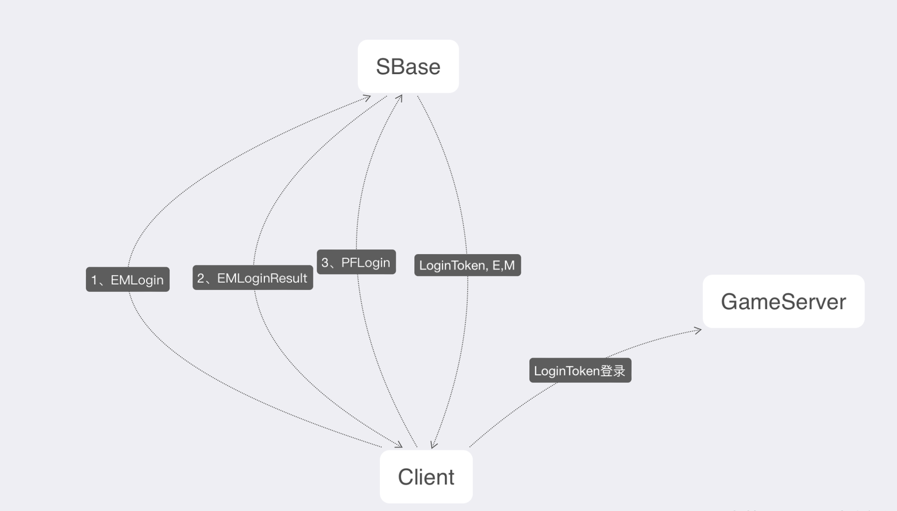

# sbasedoc 中台接入文档--后端版本

## 接口文档

### 登录
[用户登录](#login)

[用户行为上传](#usertrace)
### 支付
#### 支付下单
[微信下单](#wechat)

[支付宝下单](#alipay)

[苹果下单](#applepay)

#### 支付发货

[发货](#sendgoods)

---
### <a id="login">用户登录</a>
EMLogin 为公司快捷登录 PFLogin 为平台登录，例如：微信，QQ.....


暂时直接明文传送 LoginToken => SGameId，后续会改为加密传送
### <a id="usertrace">用户行为上传</a> 
路径：/WlcLoginTrace

```
Method: POST
ContentType: application/json
```

```go
// 请求参数 LoginTraceParam 用户行为数据上报请求参数
type WLcLoginTraceReq struct {
    Collections []*WlcLoginTrace `json:"collections"`
}

type WlcLoginTrace struct {
    SGameId   string     `json:"s_game_Id"`  // 游戏用户标识
    LoginTime string     `json:"login_time"` // 游戏用户登录时间
    BT        int        `json:"bt"`         // 游戏用户行为类型 0：下线 1：上线
    PI        string     `json:"pi"`         // 已通过实名认证用户的唯一标识 (服务器)
}

//响应参数
type WlcResp struct {
    Code int `json:"code"` //参考 code 中台常量定义
}
```
[code中台常量定义](#code)

## 支付
PF常用支付流程图


支付通用货币结构
```go
type Amount struct {
    Total    float64 `json:"total"`
    Currency string  `json:"currency"`
}
```

### <a id="wechatpay">微信下单</a>
路径：/WechatTransaction
```go
// 微信下单请求参数
type WeChatTransactionRequest struct {
    GameOrderId   string `json:"game_order_id"` //游戏订单号
    Desc          string `json:"description"`   //商品描述
    Amount        Amount `json:"amount"`    //金额
    GameNotifyUrl string `json:"game_notify_url"`  //游戏回调地址
    Attach        string `json:"attach"`    //透传数据
    SgameId       string `json:"sgame_id"`  //SgameId  玩家游戏ID
}

// 响应参数
type WeChatTransactionResponse struct {
    Code        int                  `json:"code"`
    AppPayParam *wechat.AppPayParams `json:"app_pay_param"`
}
// AppPayParams 为微信下单后返回的参数，直接传给客户端调起微信支付
type AppPayParams struct {
    Appid     string `json:"appid"`
    Partnerid string `json:"partnerid"`
    Prepayid  string `json:"prepayid"`
    Package   string `json:"package"`
    Noncestr  string `json:"noncestr"`
    Timestamp string `json:"timestamp"`
    Sign      string `json:"sign"`
}
```


### <a id="alipay">支付宝下单</a>

路径：/AliTransaction

```
Method: POST
ContentType: application/json
```
```go
// 支付宝下单请求参数
type AliTransactionRequest struct {
    GameOrderId   string `json:"game_order_id"` //游戏订单号
    Subject       string `json:"subject"`      //商品标题
    Amount        Amount `json:"amount"`    //金额
    Attach        string `json:"attach"`    //透传数据
    GameNotifyUrl string `json:"game_notify_url"` //游戏回调地址
    SgameId       string `json:"sgame_id"`  //SgameId  玩家游戏ID
    }
}
// 响应参数
AliTransactionResponse struct {
	Code    int    `json:"code"`
    OrderInfo string `json:"order_info"`
}

//OrderInfo 为支付宝下单后返回的参数，直接传给客户端调起支付宝支付
OrderInfo JSON 格式
type TradePay struct {
    ErrorResponse
    TradeNo             string           `json:"trade_no,omitempty"`
    OutTradeNo          string           `json:"out_trade_no,omitempty"`
    BuyerLogonId        string           `json:"buyer_logon_id,omitempty"`
    TotalAmount         string           `json:"total_amount,omitempty"`
    ReceiptAmount       string           `json:"receipt_amount,omitempty"`
    BuyerPayAmount      string           `json:"buyer_pay_amount,omitempty"`
    PointAmount         string           `json:"point_amount,omitempty"`
    InvoiceAmount       string           `json:"invoice_amount,omitempty"`
    FundBillList        []*TradeFundBill `json:"fund_bill_list"`
    StoreName           string           `json:"store_name,omitempty"`
    BuyerUserId         string           `json:"buyer_user_id,omitempty"`
    DiscountGoodsDetail string           `json:"discount_goods_detail,omitempty"`
    AsyncPaymentMode    string           `json:"async_payment_mode,omitempty"`
    VoucherDetailList   []*VoucherDetail `json:"voucher_detail_list"`
    AdvanceAmount       string           `json:"advance_amount,omitempty"`
    AuthTradePayMode    string           `json:"auth_trade_pay_mode,omitempty"`
    MdiscountAmount     string           `json:"mdiscount_amount,omitempty"`
    DiscountAmount      string           `json:"discount_amount,omitempty"`
    CreditPayMode       string           `json:"credit_pay_mode"`
    CreditBizOrderId    string           `json:"credit_biz_order_id"`
}
```

#### <a id="applepay">苹果支付 </a>

路径：/AppleTransaction

APPLE支付流程图


```
Method: POST
ContentType: application/json
```

```go
// 苹果下单请求参数
type AppleTransactionRequest struct {
	GameOrderId   string `json:"game_order_id"`     //游戏订单号
	Amount        Amount `json:"amount"`        //金额
	ProductID     string `json:"product_id"`    //商品ID APPLE 定义的商品ID
	Attach        string `json:"attach"`    //透传数据
	GameNotifyUrl string `json:"game_notify_url"`   //游戏回调地址
	SgameId       string `json:"sgame_id"`  //SgameId  玩家游戏ID
	GameId        string `json:"game_id"` //游戏ID 预留 可不填
	IsSandBox     bool   `json:"is_sand_box"`       //是否沙盒测试
    }
}

//响应参数
type AppleTransactionResponse struct {
    Code                int    `json:"code"`
    ApplicationUsername string `json:"application_username"` //成功订单号
}

```

#### <a id="sendgoods">发货</a>
服务器实现回调

```go
//通知参数
type SendGoodsReq struct {
	OrderId string `json:"order_id"`
	Attach  string `json:"attach"`
	Token   string `json:"token"`
}

//响应参数
SendGoodsResp struct {
	Code int `json:"code"`
}
```

### <a id="code">code中台常量定义</a>
```go
const (
    CODE_SUCCESS           = 200 //成功
    CODE_PARAM_MISS        = 116 //参数缺失
    CODE_SERVICE_BUSY      = 126 //服务器繁忙（内部逻辑错误）
    CODE_TOKEN_EXPIRED     = 128 //令牌已过期
    CODE_INVALID_NAMESPACE = 157 //无效的Namespace
    CODE_PASSWORD_ERROR    = 158 //密码错误
    CODE_ACCOUNT_NOT_EXIST = 159 //账号不存在
    CODE_SEND_SMS_TOO_FAST = 160 //发送短信过快
    CODE_VALIDATE_CODE_ERR = 161 //验证码错误
    CODE_PAYCALLBACK_ERROR = 162 //支付回调错误
    CODE_MOBILE_EXIST      = 163 //手机账号已存在
    BAN_SANDBOX            = 164 //禁止沙盒测试
    WLC_ACCOUNT_NOT_EXIST  = 165 //账号不存在
    WLC_TRACE_ERROR        = 166 //wlc上报失败
    WLC_CHECH_ERROR        = 166 //wlc校验失败
    WLC_QUERY_ERROR        = 167 //wlc查询失败
    CODE_NOT_FOUND         = 404 //APPLE资源不存在
    CODE_SERVER_ERROR      = 500 //APPLE服务器错误
)
```