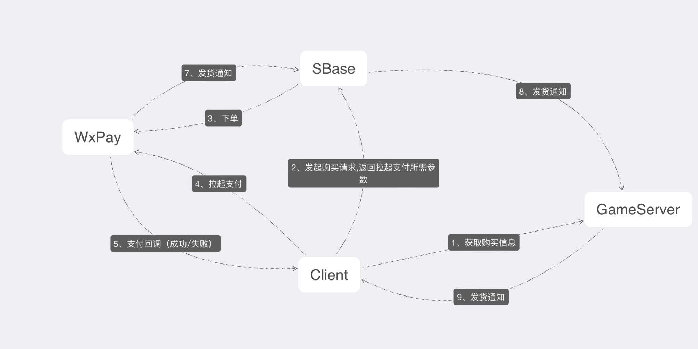

# sbasedoc 中台接入文档--后端版本

## 接口文档

### 登录
[用户登录](#login)

[用户行为上传](#usertrace)

[防沉迷相关文档](#wlc)
### 支付
[支付发货](#sendgoods)

### 签名
[后端签名规则](#sign)

### 防沉迷
[防沉迷详细规则](#chenmi)

---
### <a id="login">用户登录</a>
EMLogin 为公司快捷登录 PFLogin 为平台登录，例如：微信，QQ.....


暂时直接明文传送 LoginToken => SGameId，后续会改为加密传送
### <a id="usertrace">用户行为上传</a> 
路径：/WlcLoginTrace[README.md]

```
Method: POST
```

```protobuf
syntax = "proto3";

// 请求参数 LoginTraceParam 用户行为数据上报请求参数
message WLcLoginTraceReq {
  repeated WlcLoginTrace Collections = 1; // 用户行为数据

  string SGameId = 2; // 游戏标识
  string ReqTime = 3; // 请求时间戳
  string Sign = 4;  // 签名
}

enum BTType {
  BTTypeLogout = 0; // 下线
  BTTypeLogin = 1; // 上线
}

message WlcLoginTrace {
  int64 Uid = 1; // 游戏用户ID
  BTType BT = 2;  // 行为类型
}

//Wlc上报登录轨迹回复 SBase->Client
message WLcLoginTraceResp {
  Code Code = 1;  // 错误码  详见code中台常量定义
}
```
[签名规则](#sign)

[code中台常量定义](#code)

#### <a id="wlc">防沉迷相关文档</a>

[接口对接技术规范.pdf](../WLC/接口对接技术规范.pdf)

[网络游戏防沉迷实名认证系统.pdf](../WLC/网络游戏防沉迷实名认证系统.pdf)

## 支付
PF常用支付流程图


Apple支付流程图


### <a id="sendgoods">支付发货</a>

服务器实现回调

```protobuf
syntax = "proto3";

//发货
message SendGoodsReq {
  string OrderId = 1; // 订单ID
  string Attach = 2;  // 透传参数

  string Sign = 3;  // 签名
  string ReqTime = 4; // 请求时间
}

message SendGoodsResp {
  Code  Code = 1; // 错误码  详见code中台常量定义
}
```
[签名规则](#sign)

[code中台常量定义](#code)

## <a id="sign">后端签名规则</a>
```go
游戏标识: 后端密匙

101: A798138F62D303BFC816352120747AFC // 影之刃测试，正式服会有变动
```

请求消息中 SGameId 字段为上述中游戏标识

请求消息中的 Sign 字段：

    签名规则为：MD5(游戏标识 + "-" + 后端密匙 + "-" + ReqTime)

    ReqTime 为请求时间戳

### <a id="code">code中台常量定义</a>
```protobuf
syntax = "proto3";
//错误码
enum Code {
  CODE_DEFAULT 			      = 0;
  CODE_SUCCESS            = 200; //成功
  CODE_PARAM_MISS         = 116; //参数缺失
  CODE_SERVICE_BUSY       = 126; //服务器繁忙（内部逻辑错误）
  CODE_TOKEN_EXPIRED      = 128; //令牌已过期
  CODE_INVALID_NAMESPACE  = 157; //无效的Namespace
  CODE_PASSWORD_ERROR     = 158; //密码错误
  CODE_ACCOUNT_NOT_EXIST  = 159; //账号不存在
  CODE_SEND_SMS_TOO_FAST  = 160; //发送短信过快
  CODE_VALIDATE_CODE_ERR  = 161; //验证码错误
  CODE_PAY_CALLBACK_ERROR  = 162; //支付回调错误
  CODE_MOBILE_EXIST       = 163; //手机账号已存在
  BAN_SANDBOX             = 164; //禁止沙盒测试
  WLC_ACCOUNT_NOT_EXIST   = 165; //账号不存在
  WLC_TRACE_ERROR         = 166; //wlc上报失败
  WLC_CHECK_ERROR         = 167; //wlc校验失败
  WLC_QUERY_ERROR         = 168; //wlc查询失败
  SIGN_ERROR              = 169; //签名错误
  S_GAME_ID_NOT_EXIST      = 170; //sgame_id不存在
  CODE_LOGIN_TYP_ERROR    = 171; //未开放对应登录方式
  CODE_PAY_TYP_ERROR      = 172; //未开放对应支付方式
  CODE_IS_NOT_ADULT_LIMIT = 173; //未成年人限制
  RECHARGE_SINGLE_LIMIT   = 174; //充值单笔限额
  RECHARGE_ACCUMULATE     = 175; //充值累计限额
  CODE_NOT_FOUND          = 404; //APPLE资源不存在
  CODE_SERVER_ERROR       = 500; //APPLE服务器错误
}
```

###  <a id="chenmi">防沉迷详细规则</a>

a.游戏时长限制，未成年用户仅可在周五、周六、周日和法定节假日的20时至21时进行游戏，并在21点整点强制下线；

b.游戏消费限制，未满12周岁的用户无法进行游戏充值；12周岁（含）以上未满16周岁的用户，单次充值上限50元人民币，每月充值上限200元人民币；16周岁（含）以上未成年用户，单次充值上限100元人民币，每月充值上限400元人民币。

中台登录时会进行判定判定时候可以登录 9点强制踢 前端自行实现 